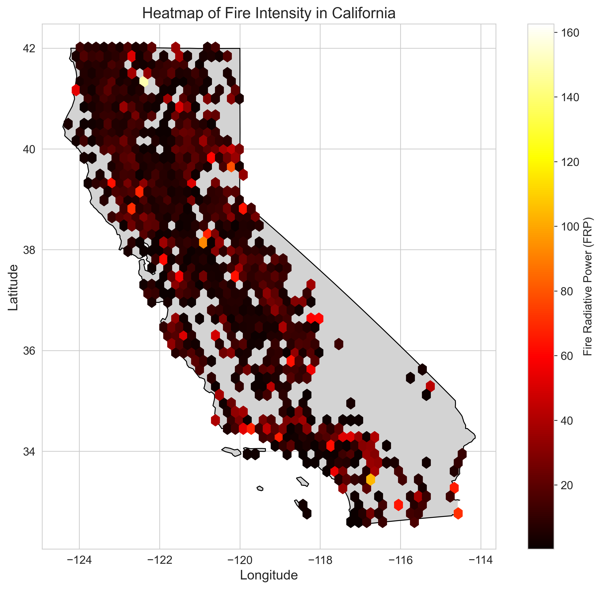
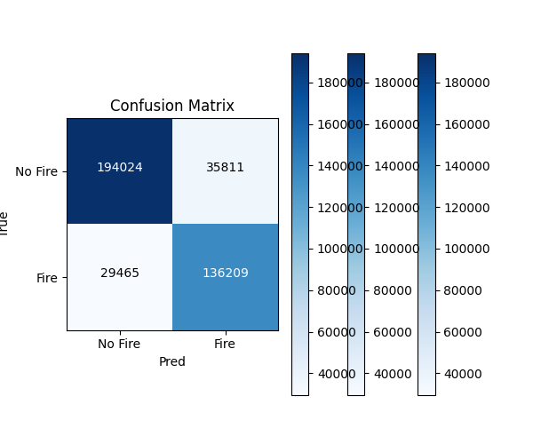
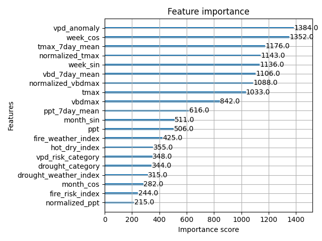
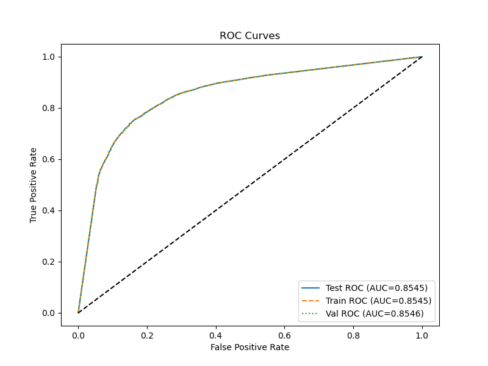
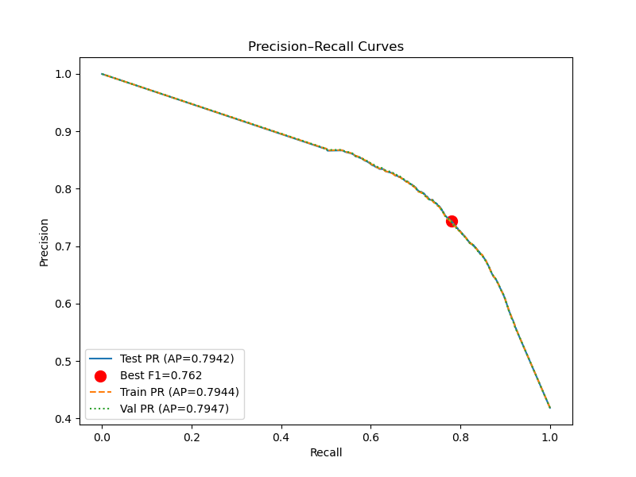

# Wildfire Prediction System

## Overview

The Wildfire Prediction System is a comprehensive data science project that predicts wildfire occurrences in California using satellite data, weather information, and historical fire records. The system employs machine learning techniques, primarily XGBoost, to analyze patterns and predict the probability of wildfires in specific geographic locations.



## Key Features

- **Predictive Modeling**: Uses XGBoost to predict wildfire probability with high accuracy
- **Geospatial Analysis**: Processes and analyzes fire data on a grid-based system
- **Weather Integration**: Incorporates weather data to improve prediction accuracy
- **Interactive Visualization**: Provides maps and charts for data exploration
- **Reproducible Workflow**: Utilizes DVC for data versioning and pipeline management
- **API-Ready**: Includes deployment code for model serving

## Model Features

The model uses various features including:

- Spatial grid-based features
- Temporal features (day of year, month, season)
- Weather data (temperature, precipitation, vapor pressure deficit)
- Drought indices
- Fire weather indices
- Historical fire patterns

## Model Results and Artifacts

The XGBoost model achieves an accuracy of 81% on the test dataset, demonstrating strong predictive capability for wildfire occurrence prediction.

### Performance Metrics

- **Accuracy**: 81%
- **Precision**: 74.34%
- **Recall**: 78.09%
- **F1 Score**: 76.17%
- **ROC AUC**: 85.45%
- **Average Precision**: 79.42%

### Confusion Matrix



This shows:

- True Negatives: 185,522
- False Positives: 44,656
- False Negatives: 36,314
- True Positives: 129,399

### Feature Importance



### ROC Curve



### Precision-Recall Curve



### Validation Results

The model was validated using train-test split and cross-validation. The close alignment between training (79.51%), validation (79.51%), and test (79.55%) accuracies indicates the model generalizes well without overfitting.

### Artifacts

The following artifacts are generated during model training and evaluation:

1. **Model Files**:

   - `artifacts/models/xgboost_model.pkl`: Trained XGBoost model

2. **Visualizations**:

   - `artifacts/figures/xgboost_feature_importance.png`: Feature importance plot
   - `artifacts/figures/xgboost_confusion_matrix.png`: Confusion matrix visualization
   - `artifacts/figures/xgboost_roc_curve.png`: ROC curve (AUC = 85.45%)
   - `artifacts/figures/xgboost_pr_curve.png`: Precision-Recall curve

3. **Metrics**:

   - `artifacts/metrics/metrics.json`: Overall model metrics
   - `artifacts/metrics/xgboost_detailed_metrics.json`: Detailed performance metrics

4. **Predictions**:
   - `artifacts/predictions/sample_predictions.csv`: Sample predictions for evaluation

## Project Structure

```
wildfire_prediction/
├── .dvc/                # DVC configuration files
├── artifacts/           # Model outputs and visualizations
│   ├── figures/         # Generated visualizations
│   ├── metrics/         # Model performance metrics
│   ├── models/          # Trained model files
│   └── predictions/     # Model predictions
├── configs/             # Configuration files
│   ├── config.yml       # General configuration
│   ├── logging.yml      # Logging configuration
│   └── params.yml       # Model parameters
├── data/                # Data directories (managed by DVC)
│   ├── external/        # External data sources
│   ├── interim/         # Intermediate processed data
│   ├── processed/       # Final processed data
│   └── raw/             # Raw input data
├── notebooks/           # Jupyter notebooks for exploration
├── pipelines/           # Data processing and model training scripts
├── src/                 # Source code
│   └── wildfire_prediction/
│       ├── data/        # Data loading and processing
│       ├── deploys/     # Deployment utilities
│       ├── features/    # Feature engineering
│       ├── models/      # Model implementation
│       ├── utils/       # Utility functions
│       └── visualization/ # Visualization utilities
├── tests/               # Unit and integration tests
├── .gitattributes       # Git LFS configuration
├── .gitignore           # Git ignore file
├── dvc.yaml             # DVC pipeline definition
├── dvc.lock             # DVC pipeline state
├── environment.yml      # Main conda environment
├── environment_xgboost.yml # XGBoost-specific environment
├── Makefile             # Common commands
└── README.md            # This documentation
```

## Installation

### Prerequisites

- Python 3.9+
- Conda or Miniconda
- Git and Git LFS
- DVC

### Setup Instructions

1. **Clone the repository**:

   ```bash
   git clone https://github.com/yourusername/wildfire_prediction.git
   cd wildfire_prediction
   ```

2. **Set up Git LFS and pull large files**:

   ```bash
   git lfs install
   git lfs pull
   ```

3. **Create and activate the conda environment**:

   ```bash
   # For general development:
   conda env create -f environment.yml
   conda activate wildfire_prediction

   # For XGBoost model training (recommended for model training):
   conda env create -f environment_xgboost.yml
   conda activate wildfire_xgboost
   ```

4. **Pull data using DVC**:

   ```bash
   dvc pull
   ```

## Data Pipeline

The data processing and model training pipeline consists of the following stages:

1. **Clean Fire Data**: Process raw satellite fire detection data
2. **Preprocess Fire Data**: Extract features and filter California wildfires
3. **Clean Weather Data**: Process weather data for the region
4. **Feature Engineering**: Create weather-related features
5. **Merge Weather and Fire Data**: Combine datasets for modeling
6. **Train XGBoost Model**: Train and evaluate the prediction model
7. **Deploy Model**: Run interactive prediction interface

### Running the Pipeline

To run the entire pipeline:

```bash
dvc repro
```

To run a specific stage:

```bash
dvc repro <stage-name>
```

Example:

```bash
dvc repro train_xgboost_model
```

## Model Training

For optimal XGBoost model training, use the dedicated environment and setup script:

```bash
# On Windows
.\setup_and_train_xgboost.ps1

# On Linux/Mac
./setup_and_train_xgboost.sh
```

Alternatively, run the training manually:

```bash
python pipelines/train_and_evaluate_xgboost_model.py
```

## Making Predictions

To run the interactive prediction interface:

```bash
python -m streamlit run pipelines/predict_and_deploy_model.py
```

This will launch a web interface where you can:

- Select locations on a map
- Input coordinates directly
- View wildfire probability predictions
- Explore feature importance

## License

This project is licensed under the MIT License - see the LICENSE file for details.

## Acknowledgments

- Fire data from MODIS and VIIRS satellite fire detections
- California boundary data from U.S. Census Bureau
- Weather data from open-meteo.com API
